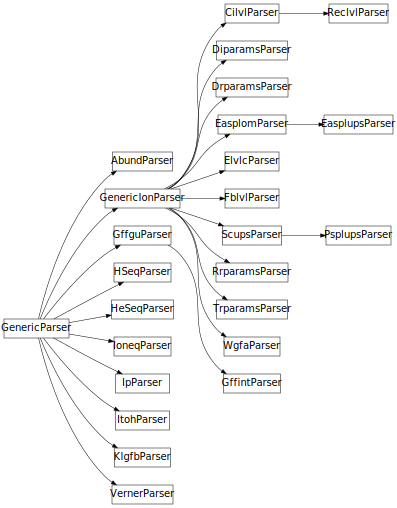
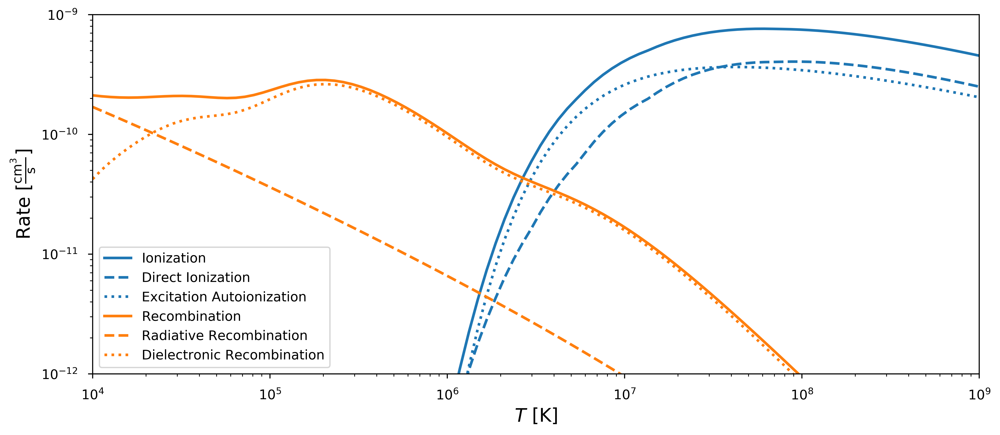

title: A Complete Fiasco
class: animation-fade
layout: true

<!-- This slide will serve as the base layout for all your slides -->
.colorstrip[
]
.bottom-bar[
    <a href="https://wtbarnes.github.io/pyastro-2018-talk">
    wtbarnes.github.io/pyastro-2018-talk
    </a>
    
]

---

class: impact
## A Complete *fiasco* 
### The Difficulties of Dealing with Atomic Data and a (Possible) Pythonic Solution

### PyAstro 2018 &ndash; New York, NY &ndash; 1 May 2018
## Will Barnes
##### Dept. of Physics & Astronomy, Rice University, Houston, TX 

???
Thank program committee for giving me a talk

Info about me

---
class: middle

# Contact Info
.col-1[
  &zwnj;
]
.col-4[
<a href="https://github.com/wtbarnes">
<i class="fa fa-github-alt fa-3x" aria-hidden="true" style="vertical-align:middle; padding-right:10px;"></i>wtbarnes</a>

<a href="https://twitter.com/wtbarnes_">
<i class="fa fa-twitter fa-3x" aria-hidden="true" style="vertical-align:middle; padding-right:10px;"></i>
wtbarnes_</a>
]
.col-7[
<a href="http://wtbarnes.github.io/">
<i class="fa fa-globe fa-3x" aria-hidden="true" style="vertical-align:middle; padding-right:10px;"></i>wtbarnes.github.io</a>

<a href="mailto:will.t.barnes@gmail.com">
<i class="fa fa-envelope fa-3x" aria-hidden="true" style="vertical-align:middle; padding-right:10px;"></i>will.t.barnes@gmail.com</a>
]

???
Mention URL at bottom of the page to find slides at

---
class: middle,center

# Atomic Physics? Who Cares?

???
Atomic data often a secondary concern in astronomy/astrophysics
Get pretty picture
Interpret pretty picture
But how?

---
class: full,middle,center
background-image: url("img/aia_ar.png")
background-size: contain

???
Need atomic data for interpretation of astronomical data
Need atomic data for simulations
* Simulating physical processes
* Simulating observations
Often forget about what the sources of atomic data are, where do the data come from, how do we make it easily available, etc.,...
In solar physics, default option for atomic data is...

---
class: middle

# The CHIANTI Atomic Database
* Look back at slides from SciPy
* [Give some background on CHIANTI here]
* [Some explanation of what CHIANTI is, what it is used for]
* [no more than two slides]
* [Number of citations, popularity]

---
class: full,middle,center
background-image: url("img/chianti_periodictable.png")
background-size: contain

???
30 elements
495 ions
Many levels per ion
Many, many transitions per ion

---
# The CHIANTI Atomic Database

* [all tools in IDL]
* Data + Software
* [Important to have python alternative]
* [Mention ChiantiPy briefly]
* [Start with many good things about CHIANTI, how it is useful, powerful tool]
* [Then some downsides]
  * ASCII data files
  * Software is freely available, but no clear way to contribute or report bugs
  * No tests
  * Some documentation, but out of date
  * IDL!
  * A collection of useful scripts rather than a library for interacting with the data
* Need a Python equivalent
* e.g. AIA response functions
* Lead into fiasco package

???
(State of software in solar will likely be covered in Dan's talk)
* IDL still overwhelmingly the standard
* SolarSoftware (SSW) is the dominant software ecosystem
* Very slow Python adoption
* "I like Python, but it doesn't have *everything* I need!"

---

.col-8[
# The *fiasco* Package

[](https://travis-ci.org/wtbarnes/fiasco)
[](http://fiasco.readthedocs.io/en/latest/?badge=latest)
[](https://coveralls.io/github/wtbarnes/fiasco?branch=master&service=github)
* First commit 9 August 2017, 196 commits as of 26 April
* Licensed under BSD 3-Clause License
* **Python 3 only** (3.6 or later)
* Documentation builds on Read the Docs
* Automated test suite run on Travis CI
* Pre-v0.1 &ndash; no formal release yet
* Pip and conda packages coming soon(*ish*)

```bash
$ git clone https://github.com/wtbarnes/fiasco.git
$ cd fiasco && python setup.py install
```
]
.col-4[
  <div style="text-align:center;">
  <figure>
  
  <figcaption><small>Image Credit: <a href="https://commons.wikimedia.org/wiki/File:HD.5A.036_(10555475386).jpg">Wikipedia</a></small></figcaption>
  </figure>
  </div>
]

???
Mention origin of name
* Type of bottle for serving CHIANTI wine
* "Serves up" the CHIANTI database
* Software development as a scientist is always a fiasco...
Not just computing quantities, but provide an intuitive interface for exploring the data
Extensible, easily used in other applications, other libraries
Should only be 3 minutes in at the end of this slide
Now talk about package
* How we parse the data
* How we reorganize the data
* How we use the data

---
class: middle,center

# Parsing the Data

???
Want to compute common quantities
First we need to get the data out
Then put it in a convenient format
Then we can actually use it

---

## A Typical CHIANTI Data File...
```shell
$ head chianti/dbase/fe/fe_16/fe_16.elvlc
```
```
1     3s    2  S    0.5          0.000          0.000
2     3p    2  P    0.5     277194.188     276436.000
3     3p    2  P    1.5     298143.094     296534.000
4     3d    2  D    1.5     675501.188     676373.000
5     3d    2  D    2.5     678405.875     679712.000
6     4s    2  S    0.5    1867740.000    1867895.000
7     4p    2  P    0.5    1977649.625    1977070.000
8     4p    2  P    1.5    1985649.500    1984703.000
9     4d    2  D    1.5    2124719.500    2124092.000
10    4d    2  D    2.5    2125959.500    2125524.000
```

???
Not so bad...
Use `readlines` + `split`
But no metadata besides a footer with information about source
Not so fast...

---
```shell
$ head -n 6 chianti/dbase/fe/fe_16/fe_16.scups
```
```
*1      2   2.519e+00   2.488e-01   3.951e-01   15    1   2.831e+00
*0.000e+00   4.098e-02   9.376e-02   1.645e-01   2.648e-01   4.218e-01   5.326e-01   6.221e-01   7.073e-01   7.527e-01   7.867e-01   8.200e-01   8.392e-01   8.547e-01   1.000e+00
*1.455e+00   1.338e+00   1.187e+00   1.064e+00   9.296e-01   7.523e-01   6.503e-01   5.789e-01   5.236e-01   4.993e-01   4.817e-01   4.652e-01   4.574e-01   4.510e-01   3.951e-01
1      3   2.702e+00   5.371e-01   7.951e-01   15    1   2.747e+00
0.000e+00   4.061e-02   9.306e-02   1.636e-01   2.641e-01   4.222e-01   5.341e-01   6.245e-01   7.104e-01   7.559e-01   7.900e-01   8.231e-01   8.422e-01   8.575e-01   1.000e+00
2.355e+00   2.291e+00   2.209e+00   2.068e+00   1.845e+00   1.525e+00   1.321e+00   1.171e+00   1.052e+00   9.979e-01   9.626e-01   9.295e-01   9.138e-01   9.010e-01   7.951e-01
```
```shell
$ head -n 3 chianti/dbase/al/al_6/al_6.psplups
```
```
1  2  2 0.000e+00 2.490e-02 6.100e+01 0.000e+00 0.000e+00 1.356e-10 6.071e-10 1.318e-09
1  3  2 0.000e+00 3.489e-02 3.250e+01 0.000e+00 0.000e+00 1.763e-11 1.525e-10 4.892e-10
*2  3  2 0.000e+00 9.997e-03 1.860e+02-1.000e-12-2.095e-12-3.666e-13 1.333e-12 9.092e-12 3.369e-11 8.857e-11 1.609e-10 1.700e-10
```

???
Sometimes one logical grouping split across multiple lines
Sometimes no space between columns


---

# Parsing the Data

.col-6[
* 13 different possible filetypes for each ion
* **Fixed-width FORTRAN format**
* Only metadata is original data source
  * No units
  * No column labels
* *Most* filetypes are described in CHIANTI documentation
* **Want:**
  * Common parser for all files
  * Metadata
  * Dataframe or Astropy Table
  * Maximize code reuse!
]
.col-6[
```
chianti/dbase/he/he_3
└── he_3.rrparams
chianti/dbase/fe/fe_16/
├── fe_16.diparams
├── fe_16.drparams
├── fe_16.easplom
├── fe_16.easplups
├── fe_16.elvlc
├── fe_16.fblvl
├── fe_16.rrparams
├── fe_16.scups
└── fe_16.wgfa
```
]

---
```python
>>> from fiasco.io import Parser
>>> p = Parser('fe_16.elvlc')
>>> p.parse()
level  config  label multiplicity L_label  J   E_obs       E_th   
                                               1 / cm     1 / cm  
----- -------- ----- ------------ ------- --- -------- -----------
    1   3s2.3p                  2       P 0.5      0.0         0.0
    2   3s2.3p                  2       P 1.5  18852.0     18332.0
...
>>> Parser('al_6.psplups').parse()
lower_level upper_level bt_type  gf delta_energy  bt_c    bt_rate [9]   
                                         Ry                             
----------- ----------- ------- --- ------------ ----- -----------------
          1           2       2 0.0       0.0249  61.0        0.0 .. nan
          1           3       2 0.0      0.03489  32.5        0.0 .. nan
          2           3       2 0.0     0.009997 186.0 -1e-12 .. 1.7e-10
```

---

.col-7[
```python
>>> type(Parser('fe_16.elvlc'))
fiasco.io.sources.ion_sources.ElvlcParser
>>> type(Parser('al_6.psplups'))
fiasco.io.sources.ion_sources.PsplupsParser
```

* `ParserFactory` *metaclass* creates parser classes "on the fly"
* *Factory pattern* &ndash; common software design pattern
* Filetype determines parser class
* In most simple case, a parser class just provides
  * headings
  * units
  * types
  * descriptions
]
.col-5[
  
]

???
Give good example of factory pattern
Common software engineering design pattern
This is how SunPy handles map creation for different instruments
Mention benefit to user
Valuable if all you want to do is read a CHIANTI data file
Should be 7 minutes in here (~halfway)

---
class: center, middle

# Building an HDF5 Database

---

* Want to avoid repeatedly parsing, reading plaintext files
* Solution: HDF5!
  * **H**ierarchical **D**ata **F**ormat...5
  * Filetree in a single blob
  * Good Python support: [h5py](http://docs.h5py.org/en/latest/) and [PyTables](https://www.pytables.org/)
* Read parts of file without unnecessary memory overhead
* `GenericIonParser` has a `to_hdf5()` method,
  ```python
  import h5py
  table = p.parse()
  # Write 
  with h5py.File('chianti.h5', 'w') as hf:
      p.to_hdf5(hf, table)
  # Read
  with h5py.File('chianti.h5', 'r') as hf:
      E_obs = np.array(hf['fe/fe_16/elvlc/E_obs'])
  ```

---
class: middle

* Interface between HDF5 file and the code:
  1. Provides separation between the computation and the data I/O
  2. Maximize code reuse
* Provides an internal API for the data
* Nuances of the data are hidden from the user

```python
>>> from fiasco import DataIndexer
>>> d = DataIndexer('chianti.h5', '/h')
>>> type(d)
fiasco.datalayer.DataIndexerLocal
>>> 'h_1' in d
True
>>> type(d['h_1'])
fiasco.datalayer.DataIndexerLocal
>>> d['h_1/elvlc/E_obs']
Quantity< [     0.     82258.956  ... ] 1 / cm>
```

???
* Two slides
  * How the data are built into the HDF5 file 
  * How the data are accessed from the file
* Try for only 2,3 minutes here
* How the HDF5 files are built
* How they are structured
* Datalayer as a separation between the API and the data itself

---
class: middle,center

# The fiasco API: Using the Data

???
* Use of `__add__`, `__getitem__`
* Show features of the package, particularly for exploring data
* Highlight `Ion`, `Element`, `IonCollection`
* Show ionization equilibrium, spectra, radiative losses

---
class: middle
## Three (really two) Primary Objects
* `Ion`
* `Element`
* `IonCollection`

---
## `Ion` Object
```python
>>> import fiasco
>>> import numpy as np; import astropy.units as u
>>> t = np.logspace(4,8,100)*u.K
>>> ion = fiasco.Ion('Fe 16', temperature=t)
# Equivalently
>>> fiasco.Ion('Fe +15', t), fiasco.Ion('iron 16', t);
# Basic metadata
>>> ion.element_name, ion.atomic_symbol, ion.atomic_number
('iron', 'Fe', 26) 
>>> ion.ion_name, ion.ionization_stage, ion.charge_state
('Fe 16', 16, 15)
```

???
Main object in fiasco is `Ion`, the "building block"
Inspiration from ChiantiPy package
Units everywhere
Instantiate ions in multiple ways

---
.col-7[
```python
>>> ion
CHIANTI Database Ion
---------------------
Name: Fe 16
Element: iron (26)
Charge: +15
Number of Levels: 161
Number of Transitions: 2815

Temperature range: [0.01 MK, 100.0 MK]

HDF5 Database: .fiasco/chianti_dbase.h5
Using Datasets:
  ioneq: chianti
  abundance: sun_photospheric_1998_grevesse
  ip: chianti
```
]
.col-5[
* String representation of an object set by `__repr__` method 
* Gives meaningful information about your object!
```python
>>> class Foo():
            pass
>>> Foo()
<__main__.Foo at 0x11a30b7f0>
>>> class Foo():
            def __repr__(self):
                return 'foo!'
>>> Foo()
'foo!'
```
]
---
class: middle

* Access to basic CHIANTI quantities
```python
>>> ion.abundance
<Quantity 3.1622776601683795e-05>
>>> ion.ip.to(u.eV)
<Quantity 489.2763585014938 eV>
```
* As well as the more complicated "raw" CHIANTI data
```python
>>> ion._elvlc['E_obs']
<Quantity [  0.00000000e+00,  2.77194188e+05, ... ] 1 / cm>
>>> ion._wgfa['wavelength']
<Quantity [ 360.758, 335.409, ... ] Angstrom>
```

???
Access abundance, ionization potential 
Note the use of `_` with raw data
Not meant to be user facing
Data used to calculate more useful quantities
Abstract away the CHIANTI filetypes -- they are not user friendly
---

### Derived Quantities
```python
>>> ion.ionization_rate()
<Quantity [  2.18538687e-258,  1.84291825e-236, ...] cm3 / s>
>>> ion.recombination_rate()
<Quantity [  2.11925041e-10,  2.08729127e-10, ...] cm3 / s>
```

<div style="text-align:center;">

</div>

---

.col-6[
### Energy Levels
```python
>>> ion[0]
Level: 1
Configuration: 3s
Orbital Angular Momentum: S
Energy: 0.0 erg
>>> ion[1].level
2
>>> ion[1].configuration
'3p'
>>> for level in ion:
        print(level.energy.to(u.eV))
0.0 eV
34.36769892212881 eV
36.96503221887158 eV
...
```
]
.col-6[
* Index to access energy levels of an ion, returns a `Level` object 
* Intuitive interface to energy levels
* The levels "belong" to the ion
* Use the `__getitem__` method to index, iterate class
```python
>>> class Foo():
            _list = [1,2,3]
            def __getitem__(self,key):
                return self._list[key]
>>> Foo()[0]
1
```
]

---

## `Element` Object

---

## `IonCollection` Object

---
class: center,middle

# Infrastructure Challenges

???
* Distibuting and versioning data
* Interaction with other databases
* Serving data remotely with h5serv

---
class: middle

## A Problem...
* Documentation includes autogenerated plots, require atomic data
* To publish on Read the Docs, need data on Read the Docs
* Downloading + building HDF5 data = build timeout
* Can we avoid downloading the data altogether?

---
class: middle,center,full
background-image: url("img/cloud_diagram.png")
background-size: contain

---
class: middle

## Some Open Questions...
* Distributing and versioning data?
* Use with other formats? e.g. MongoDB, SQLAlchemy,
* Use with other databases? e.g. AtomDB, Cloudy, others

???
Can we provide just the HDF5 files? (who is the "we"?)
For performance reasons, maybe HDF5 is not the best option
Could we use an actual database? (what a novel idea...)
Can we abstract away **all** CHIANTI specific behavior
Perhaps have a plugin system for different databases
Good questions for discussion
How have others dealt with this problem?

---
class:middle

# Resources
.col-6[
<a href="https://github.com/wtbarnes/fiasco">
<i class="fa fa-github-alt fa-3x" aria-hidden="true" style="vertical-align:middle; padding-right:10px;"></i>wtbarnes/fiasco</a>

<a href="http://fiasco.readthedocs.io/en/latest/">
<i class="fa fa-book fa-3x" aria-hidden="true" style="vertical-align:middle; padding-right:10px;"></i>fiasco.readthedocs.io</a>
]
.col-6[
<a href="https://github.com/wtbarnes/pyastro-2018-talk">
<i class="fa fa-code fa-3x" aria-hidden="true" style="vertical-align:middle; padding-right:10px;"></i>wtbarnes/pyastro-2018-talk</a>

<a href="http://www.chiantidatabase.org/">
<i class="fa fa-globe fa-3x" aria-hidden="true" style="vertical-align:middle; padding-right:10px;"></i>CHIANTI Webpage</a>
]

---
class: middle

# Acknowledgment

* CHIANTI Team
* Ken Dere (ChiantiPy)
*  SunPy project
  * Stuart Mumford (NSO)
  * David Pérez-Suárez (UCL)
*  PlasmaPy project
  * Nick Murphy (CfA)
  * Drew Leonard (Sheffield)
* Stephen Bradshaw (Rice)
* Slides built with [**backslide**](https://github.com/sinedied/backslide) and [**Remark.js**](https://github.com/gnab/remark)
